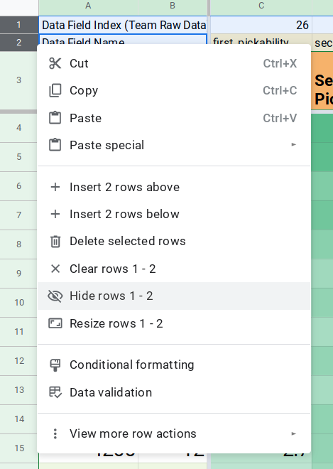

# Things to do before the picklist meeting

Before the picklist meeting, it is important to hide unnecessary rows and columns in the spreadsheet used only for development purposes. To hide a set of rows or columns, select them by clicking on them in the edges of the spreadsheet, and then right click:

You can select multiple rows or columns by clicking and dragging over the rows or columns.

Below is a list of rows and/or columns that should be hidden during the meeting:

* Main Editor rows 1 - 2
  
     * These hold raw data point names and their column indexes in the Team Raw Data sheet, and should not be visible.

* Team Comparison Graphs rows 2 - 4
  
     * Rows 2 and 3 hold indexes for the selected TIM data point and row 4 is unimportant.

* Team Comparison Graphs rows 6 - 17
  
     * These hold raw data values used to create the graph, and should not be visible.

* Team Comparison Graphs columns C, F, I, L
  
     * These hold match number data used to get the TIM data and create the match number chart.
