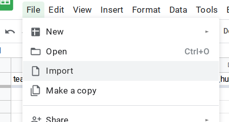
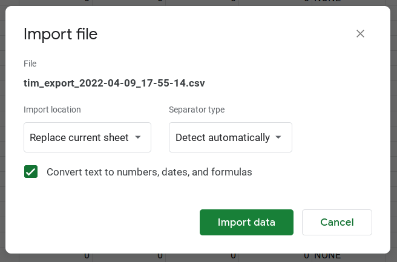

# Importing raw data

## CSV files

In order for data to be properly displayed in the Picklist Editor, you must import raw data generated by the server. These should come in the form of CSV (comma-separated values) files. Ideally you will be sent the CSV files and be able to download them to your computer. The three important CSV files are the team raw data, TIM raw data, and images files.

## Importing the files

Importing the files is relatively straightforward, and the way to do it is mostly the same. These are the steps for the TIM raw data:

1. Navigate to the TIM Raw Data sheet.

2. In the top bar, select `File > Import`:
   
   

3. In the popup that opens, go to the `Upload` tab:
   
   

4. Upload the CSV file for the TIM data. You should immediately see another popup with some options on how to import the file.

5. Set the `Import location` dropdown to `Replace current sheet`. The popup should now look something like this:
   
   

6. Click `Import data`.

7. Make sure the data now in the sheet matches the data from the CSV file. If everything worked correctly, the data should be correctly imported.

You can now follow almost the same steps to import the other raw data files.
